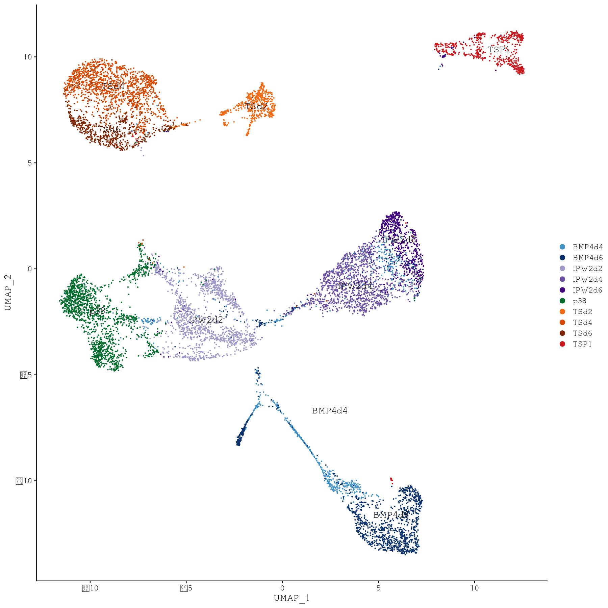

# Single-Cell RNA-seq of HiPS differentiated to trophoblast stem cells

## Description

This repo contains the code for the Single-Cell RNA-seq analysis performed in the paper
**Single-cell analysis of primed human stem cell specification to trophoblast stem cells reveals gene expression programs resembling fetal cytotrophoblasts with activation of human endogenous retroviruses and expression of Corona virus associated host factors**, submited at Cell Stem Cell [Tietze _et al._ (2020)](https://doi.org/...).

